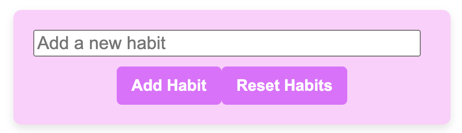
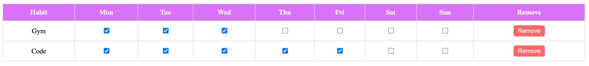
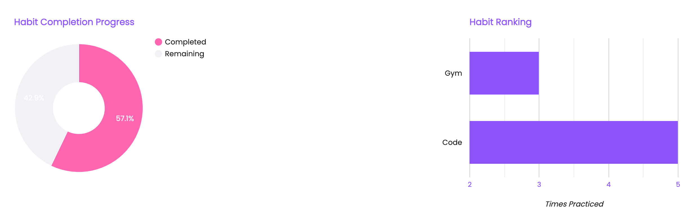
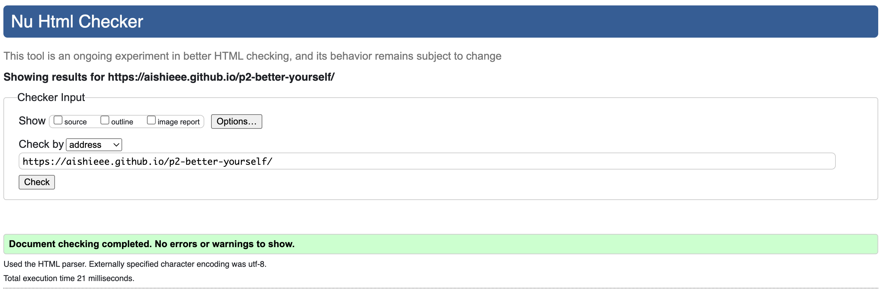
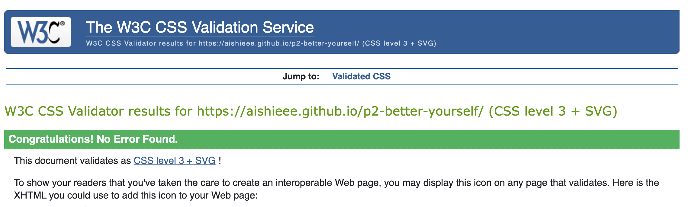

# Habit Tracker - Better Yourself

This project is a simple yet effective habit tracker built using HTML, CSS, and JavaScript. It enables users to track their habits throughout the week, empowering them to improve their behaviour and discipline. Users can add new habits, log their daily progress, and visualise this achievement through interactive Google Charts. The site uses the browser's localStorage to save habits and progress across sessions.

# Project Goals 

User goals:
- **Encourage Self-Improvement:** Help users reflect on their habits and identify areas for improvement to promote discipline and positive behavior.
- **Interactive Tracking:** Provide an engaging interface for adding habits and marking daily progress. 
- **Visual Insights:** Offer visually appealing and easy-to-understand Google Charts to help users monitor progress and focus on achieving their goals.
- **Skill Development:** Support users in enhancing their skills by forming and maintaining productive habits.

Site owner goals:
- **Drive Engagement:** Create a website that encourages users to increase productivity and adopt better habits.
- **Provide Value:** Develop a meaningful tool that benefits individuals looking to foster growth and self-improvement.

# Features

### 1. Habit Management

**Add New Habits:** Users can input any habit they want to track using the input field. New habits appear in a dynamic table.
**Reset All Habits:** Users can clear all habits from the table and reset their progress to start fresh.

### 2. Habit Tracking Table
**Daily Progress Tracking:** Users can mark each day of the week as completed using a row of checkboxes for every habit.
**Data Storage:** All habits and progress are saved using the browser's localStorage, ensuring data remains available even after the page reloads.
**Remove Habits:** Users can delete individual habits they no longer wish to track.

### 3. Progress Visualisation
**Interactive Google Charts:** Two charts provide a clear visual on habit progress:
Pie Chart: Displays the proportion of completed versus remaining (incomplete) habit days for the week.
Bar Chart: Represents habits based on the number of times they were completed during the week, showing a visual summary of performance.

# Testing

## HTML

## CSS

