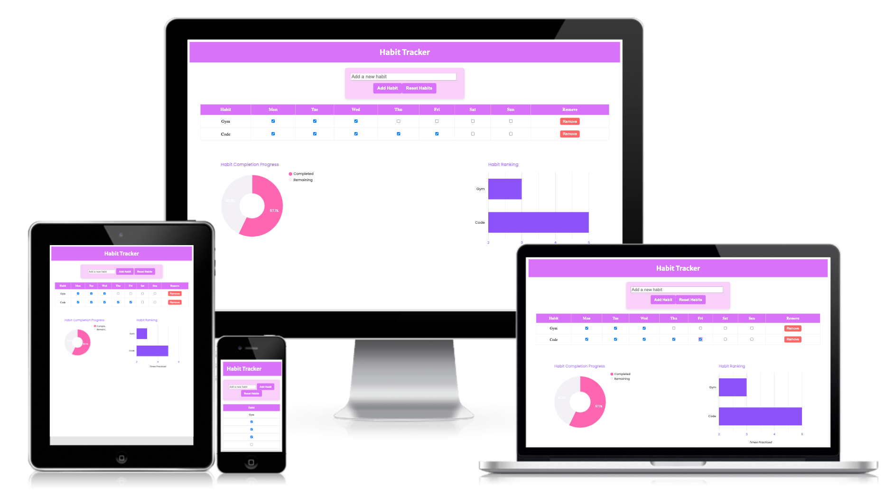
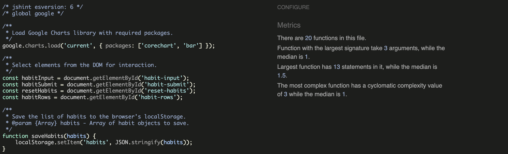
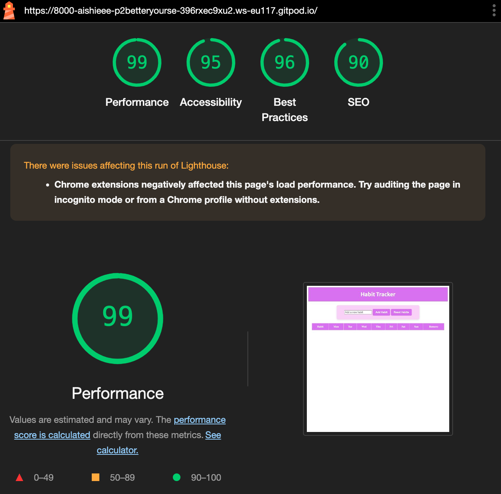

# Habit Tracker - Better Yourself

This project is a simple yet effective habit tracker built using HTML, CSS, and JavaScript. It enables users to track their habits throughout the week, empowering them to improve their behaviour and discipline. Users can add new habits, log their daily progress, and visualise this achievement through interactive Google Charts. The site uses the browser's localStorage to save habits and progress across sessions.

# Project Goals 

User goals:
- **Encourage Self-Improvement:** Help users reflect on their habits and identify areas for improvement to promote discipline and positive behavior.
- **Interactive Tracking:** Provide an engaging interface for adding habits and marking daily progress. 
- **Visual Insights:** Offer visually appealing and easy-to-understand Google Charts to help users monitor progress and focus on achieving their goals.
- **Skill Development:** Support users in enhancing their skills by forming and maintaining productive habits.

Site owner goals:
- **Drive Engagement:** Create a website that encourages users to increase productivity and adopt better habits.
- **Provide Value:** Develop a meaningful tool that benefits individuals looking to foster growth and self-improvement.

# Features

### 1. Habit Management

**Add New Habits:** Users can input any habit they want to track using the input field. New habits appear in a dynamic table.
**Reset All Habits:** Users can clear all habits from the table and reset their progress to start fresh.

### 2. Habit Tracking Table
**Daily Progress Tracking:** Users can mark each day of the week as completed using a row of checkboxes for every habit.
**Data Storage:** All habits and progress are saved using the browser's localStorage, ensuring data remains available even after the page reloads.
**Remove Habits:** Users can delete individual habits they no longer wish to track.

### 3. Progress Visualisation
**Interactive Google Charts:** Two charts provide a clear visual on habit progress:
Pie Chart: Displays the proportion of completed versus remaining (incomplete) habit days for the week.
Bar Chart: Represents habits based on the number of times they were completed during the week, showing a visual summary of performance.

# Testing

### HTML

[W3C HTML Validator](https://validator.w3.org/) was run to check the index.html code. There were no errors or warnings found.

### CSS

[W3C CSS Validator](https://jigsaw.w3.org/css-validator/) was run to check the style.css code. There were no errors found.

### Javascript

[JSHint](https://jshint.com/) was used to check the script.js code. 

Code Metrics: 

**Analysed Number of Functions:** 20
**Function Arguments:**
- Largest signature: 3 arguments
- Median signature: 1 argument
**Function Size:**
- Largest function: 13 statements
- Median function: 1.5 statements
**Cyclomatic Complexity:**
- Most complex function: 3
- Median complexity: 1

JSHint Warnings and Fixes:

Initially, there were warnings related to the use of ECMAScript 6 (ES6) features, which were not recognised by JSHint. Also, JSHint flagged Google as an unrecognised variable since I was using this for my charts. To address these issues, I added the necessary configuration at the beginning of the file to ensure ES6 compatibility. Additionally, I replaced inline comments above each function with docstrings for improved clarity and documentation.

After implementing these changes, I re-ran JSHint, and no further warnings were detected.

### Accessibility 

- I inspected the website using Google Chrome Developer tools and ran the pages through Lighthouse. This confirmed that the colours and fonts are easy to read, and the site is accessible, as it received all green scores.

- I tested and confirmed that the page works in different browsers; Chrome, Safari and Firefox.

# Bugs

Problem: The first issues encountered was related to saving, removing, and rendering habits in the table:

1. Habits were not correctly saved: When new habits were added, they were not properly stored in localStorage.
2. Habit removal did not update the table: After removing a habit, the table did not refresh to reflect the changes.
3. Table rendering issues: The habit table did not display the current state of habits correctly after adding or removing habits.

Fix:
- Initially, there was an incorrect implementation of the saveHabit function, which was not properly saving the habits to localStorage. I removed repeated localStorage.setItem('habits', JSON.stringify(habits)); and merged this logic into a simpler saveHabits function. 

Problem: Inefficiencies and redundant operations, which led to performance issues and unnecessary complexity in the code. 

4. The loadAndRenderHabits function duplicated functionality already handled by loadHabits.
5. The addHabit logic did not handle the case where no habits were initially present in localStorage.
6. The calculation for remaining days in the progress charts was performed inside a loop

Fix:
- The loadHabits function was updated to directly handle rendering habits in the table by calling renderHabitInTable for each habit which removed the need for the loadAndRenderHabits function. 
- Previously, addHabit did not properly initialise the habits array if it was empty. I fixed this by ensuring that the habits array is initialised with either the existing habits from localStorage or an empty array if none exist.
- The remainingDays calculation for the progress chart was moved outside the loop to prevent unnecessary recalculations for each habit

# Deployment 

#### Version Control 

The website was developed using the Gitpod editor and uploaded to a GitHub remote repository named 'p2-better-yourselfp2-better-yourself'. Throughout the development process, Git commands facilitated the management of code updates. These included:

- Using git add . to stage files before committing changes.

- Employing git commit -m "commit message" to finalise changes in the local repository.

- Using git push to upload all committed code to the GitHub remote repository.

#### Deploying to Github Pages involved the following steps:

1. Navigate to the Settings tab of the Github repository.

2. Choose the Master branch from the source section drop-down menu and save the settings.

2. Upon selecting the Master branch, the website link was generated.

Live link: <a href="https://aishieee.github.io/p2-better-yourself/">Project 2 - Better Yourself</a>

#### To clone the repository code locally, follow these steps:

1. Access the GitHub repository you wish to clone.

2. Click on the "Code" button located above the project files.

3. Select "HTTPS" and copy the repository link.

4. Open your preferred Integrated Development Environment (IDE) and paste the copied Git URL into the IDE terminal.

This action creates a local clone of the project.

